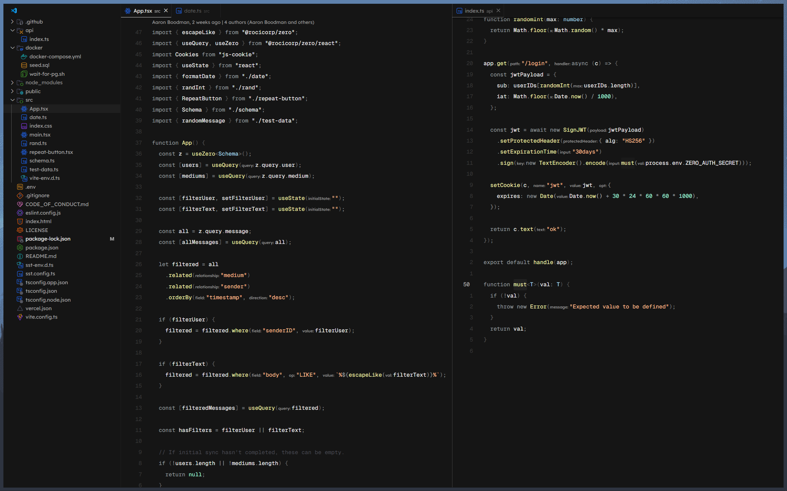

# Dots, kinda

I use Windows, so I can't really have a proper ~/.dots system, but I store my configs here in case my computer ever explodes and I need to set up my new one fast.

## But why Windows

I have to. I use Windows for work, and I tried dual booting but didn't like the hassle of configuring two systems.

## Configs

### VSCode

This is for my theme, keybindings, and settings.json. I should probably publish my theme properly so I don't need to do this, but oh well.

#### Requirements

Fonts required: Geist Mono Variable, and Lexend.

#### Note on theme

It's not perfect. I made a minimal theme myself with the tokens geared towards JS/TS/React development. It may look bad in other languages, idk.

Again, it's a local theme, so you have to install it manually in vscode if it doesn't show up, which is easy to do. Move the minimal-theme folder to ~/.vscode/extensions/, reload vscode, should show up.

#### Note on settings

I use vim keybindings. If you just copy everything and are not used to vim keybindings, you may think you broke your vscode.

### Powertoys

Keyboard manager (mainly to remap CAPS => ESC for vim, but also small shortcut remaps), and FancyZones for tiling. One day I'm switch move to Linux and use hyprland - I dream of this day.

### Terminal

Just threw some configs here, not much customization here apart from some colors.
